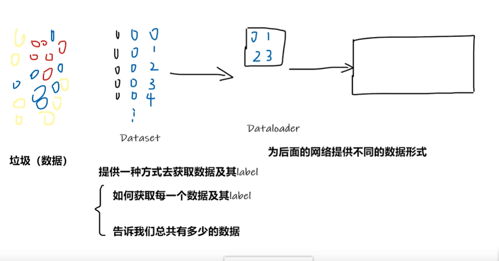
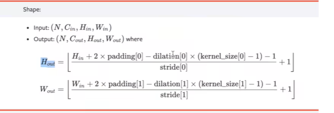
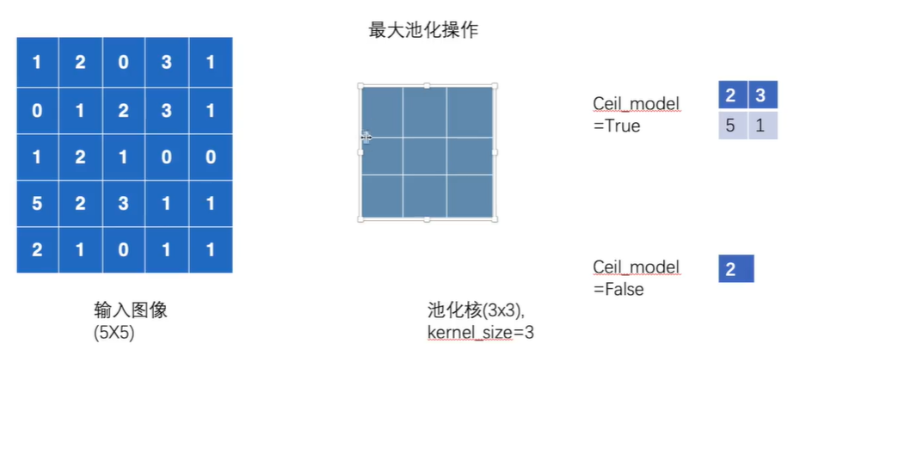
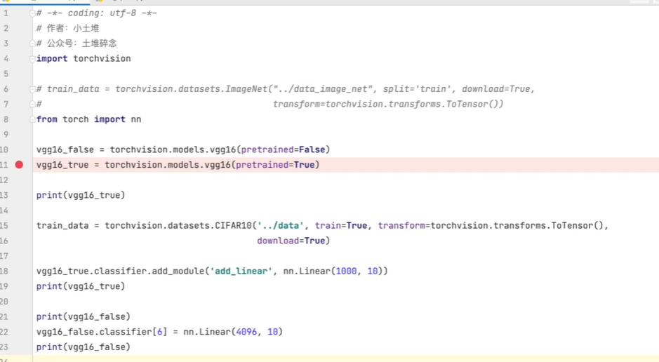
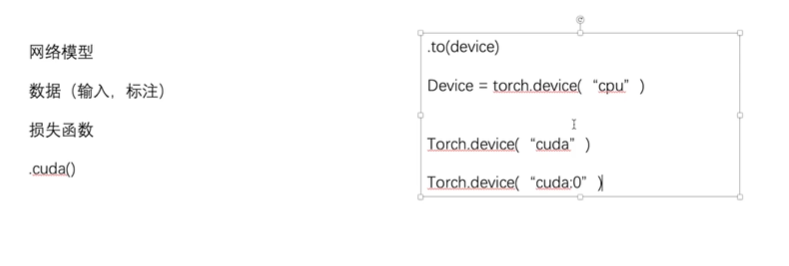
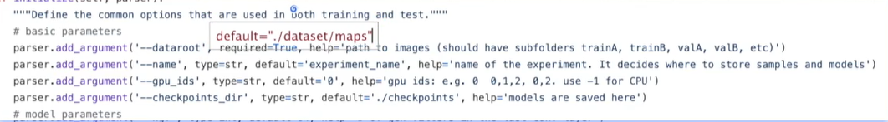

### Dataset 与 Dataloader



Dataset ： 提供一种方式去获取数据及其label，告诉我们总共有多少数据

Dataloader : 为后面的网络提供不同的数据形式

<!--more-->

### TensorBoard

tensorboard --logdir=logs --port=6007


### CNN

#### 卷积层



#### 池化层



input = torch.tensor([[    ]] , dtype = torch.float32)

#### 非线性激活

### 现有模型的修改



### 模型的保存

```python
net = Net()
# 保存方式1
torch.save(net, "net_method1.pth")
# 方式1-> 模型定义必须带过来
model = torch.load("net_method1.pth")
```

### 利用GPU训练





