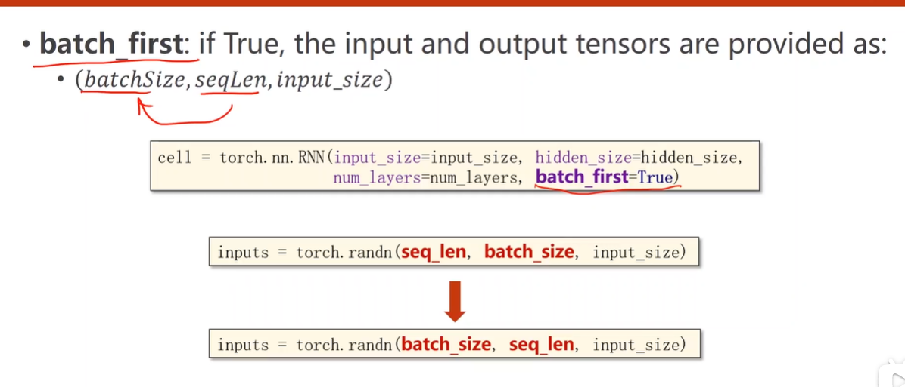

 

注意:**维度灾难**

新的挑战

Limit of hand-designed feature.

SVM can not handle big data set well.

More and more application need to handle unstructured data.

<!--more-->

## 线性模型 Linear Regression

**过拟合       |       泛化**

1.Function ： y= b + w x1

2.Define Loss from Training Data: Loss is a function of parameters L(b,w)
$$
e_i =| y'_i - y_i |
$$

$$
Loss : L = \frac{1}{N}  \sum_n e_n
$$

:L is mean absolute error (MAE) 
$$
e_i = (y'_i-y_i)^2
$$
：L is mean square error(MSE)


3.Optimization:
$$
w^*,b^* = arg   min_w,_b L
$$


```python
#下两行解决坐标轴不能显示中文问题
from pylab import *
mpl.rcParams['font.sans-serif'] = ['SimHei']

from mpl_toolkits.mplot3d import Axes3D  # mpl_toolkits.mplot3d是Matplotlib里面专门用来画三维图的工具包。

#设函数为 y = 2.5x + 0.8
x_data = [1.0,2.0,3.0]
y_data = [2.0,4.,6.]

#前向传播
def forward(x):
    return x * w + b

#损失函数
def loss(x,y):
    y_pred = forward(x)
    return (y_pred-y)*(y_pred-y)

mse_list = [] #记录权重（W）平均损失值
W=np.arange(0.0,4.1,0.1) # 权重 W 从0.0到4.0 间隔0.1取数
B=np.arange(0.0,4.1,0.1) # 偏置 B 从0.0到4.0 间隔0.1取数
[w,b]=np.meshgrid(W,B)  # [X,Y]=np.meshgrid(x,y) 函数用两个坐标轴上的点在平面上画网格。
'''
用法：
　　[X,Y]=meshgrid(x,y)
　　[X,Y]=meshgrid(x)与[X,Y]=meshgrid(x,x)是等同的
　　[X,Y,Z]=meshgrid(x,y,z)生成三维数组，可用来计算三变量的函数和绘制三维立体图
'''

l_sum = 0 #累加损失值的变量

for x_val, y_val in zip(x_data, y_data):
    y_pred_val = forward(x_val)
    print(y_pred_val)
    loss_val = loss(x_val, y_val)
    l_sum += loss_val #累加损失值


print(w.shape)
print(l_sum)
print(l_sum.shape)
fig = plt.figure()
ax = Axes3D(fig) #Axes3D是mpl_toolkits.mplot3d中的一个绘图函数
ax.plot_surface(w, b, l_sum/3, cmap='rainbow') #画曲面图---Axes3D.plot_surface(X, Y, Z)
ax.set_xlabel("权重 W")
ax.set_ylabel("偏置项 B")
ax.set_zlabel("损失值")
plt.show()
```

## 梯度下降算法 Gradient Descent

3.Optimization:
$$
w^*,b^* = arg   min_w,_b L
$$


非凸函数----   局部最优


鞍点 **(最大问题)**


指数加权均值
$$
C'_0 = C_0,
C'_i = βC_i + (1-β) C'_{i-1}
$$
**训练失败**:1.学习率太大


#### 随机梯度下降 Stochastic Gradient Descent


注意：梯度下降 比  随机梯度下降 效率高 （并行计算） 

所以采用：Mini-Batch (Batch)


## Back Propagation


## 用Pytorch实现线性回归

1.Prepare dataset

2.Design model using Class :y_	pred

3.Construct loss and optimizer

4.Training cycle:forward backward update


线性单元Linear Unit：z=w*x+b 


## 逻辑回归 Logistic Regression （分类任务）


R->[0,1]

Logistic Function: 
$$
F（x)=\frac{1}{1+e^{-x}}
$$


#### cross - entropy 交叉熵


越大越好(对数都小于1 结果都是负数 ， 总之 越接近0越好)


#### 模型步骤


## 处理多维数据的输入


为何向量化？：利用CPU/GPU并行能力提高运算效率 


## DataSet and DataLoader

DataSet 抽象类

DataLoader:batch_size = 2 , shuffle = True 


## 多分类问题  Softmax Classifier


NLL LOSS


CrossEntropyLoss


#### 处理图像多分类任务


**为什么要激活？**

​       简单的堆叠网络层，而不经过非线性激活函数激活，并不能学习到新的特征学到的仍然是线性关系。


## 卷积神经网络 CNN

1.能保留空间信息 


卷积核通道数量 是 输入通道数  N

卷积核的个数 是 输出通道数   M

### CNN的多个卷积核为什么能提取到不同的特征

答案原文：[https://www.quora.com/Why-does-each-filter-learn-different-features-in-a-convolutional-neural-network](https://link.zhihu.com/?target=https%3A//www.quora.com/Why-does-each-filter-learn-different-features-in-a-convolutional-neural-network)

下面是机翻

两个原因:

1.过滤器的权重是随机初始化的

2.只有卷积核学习到不同的特征，才会减少成本函数

随机初始化的权重可能会确保每个过滤器收敛到成本函数的不同的局部最小值。

每个过滤器开始模仿其他过滤器是不可能的，因为这几乎肯定会导致成本函数的增加，梯度下降算法不会让模型朝这个方向发展。

### Convolutional Layer 


#### padding

 外围填充0

kernel_size / 2 

#### stride 

步长 默认为 1

输出大小 =  （输入大小+padding*2-kernel_size)/stride + 1 


### Max Pooling  Layer 

默认 stride = 2


## Advanced CNN

#### GoogleNet


#### Residual Learning


## 循环神经网络RNN

**处理具有序列关系的数据**

例如：时间，天气，**自然语言**

#### RNNs


**两种构建RNN的方式**


#### RNNCell

cell = torch.nn.RNNCell(input_size=input_size, hidden_size=hidden_size)


hidden = cell(input, hidden)


example:


#### RNN


##### batch_first



### example

##### 1.RNNCell


**注意：RNN Cell should be vectors of numbers.**


##### 2.RNN


### 补充

#### one_hot encoding的改进 --EMBEDDING


优点：Lower-dimension 、Dense、Learned from data


output of embedding layer with shape:(seqlen,batchSize, **Embedding_Size**)

## RNN应用

### 1.模型


#### 双向循环网络bidirectional


#### GRU


为什么线性层是 hidden_size * self.n_directions：


疑问1.为什么RNN层 后 接Linear层 要用 output作为结果 而不是 hidden 


## Torch

#### Tenser.size()

该方法返回的是当前张量的形状,返回值是元组tuple的一个子类. 


#### \__call__()


继承 torch.nn.Module 

\__call__函数 中 自动调用 forward()  


#### enumerate

enumerate() 函数用于将一个可遍历的数据对象(如列表、元组或字符串)组合为一个索引序列，同时列出数据和数据下标， 


seasons = ['Spring', 'Summer', 'Fall', 'Winter']
 list(enumerate(seasons))
[(0, 'Spring'), (1, 'Summer'), (2, 'Fall'), (3, 'Winter')]
 list(enumerate(seasons, start=1))       # 下标从 1 开始
[(1, 'Spring'), (2, 'Summer'), (3, 'Fall'), (4, 'Winter')]

