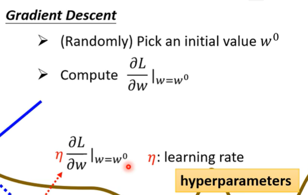
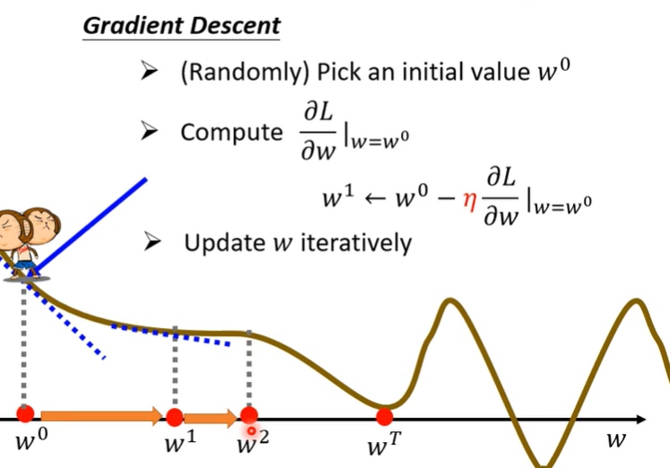
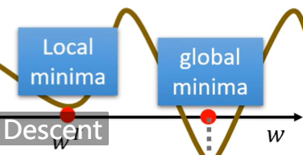

## 概述

机器学习使计算机能够从研究数据和统计信息中学习。

机器学习是迈向人工智能（AI）方向的其中一步。

机器学习是一种程序，可以分析数据并学习预测结果。

<!--more-->

#### 数据类型

我们可以将数据类型分为三种主要类别：

- *数值（Numerical）*
- *分类（Categorical）*
- *序数（Ordinal）*

*数值数据*是数字，可以分为两种数值类别：

- 离散数据（Discrete Data）

  - 限制为整数的数字。例如：经过的汽车数量。

- 连续数据（Continuous Data）

  - 具有无限值的数字。例如：一件商品的价格或一件商品的大小。

*分类数据*是无法相互度量的值。例如：颜色值或任何 yes/no 值。

*序数数据*类似于分类数据，但可以相互度量。示例：A 优于 B 的学校成绩，依此类推。

#### 平均数 mean方法

```
import numpy

speed = [99,86,87,88,111,86,103,87,94,78,77,85,86]

x = numpy.mean(speed)

print(x)
```

#### 中位数 median方法

```
x = numpy.median(speed)
```

#### 众数 mode方法

请使用 SciPy mode() 方法查找出现次数最多的数字：

 

```
from scipy import stats

speed = [99,86,87,88,111,86,103,87,94,78,77,85,86]

x = stats.mode(speed)

print(x)
```

#### 标准差 std方法

```
x = numpy.std(speed)
```

#### 方差 var方法

```
x = numpy.var(speed)
```

#### 百分位数 percentile方法

统计学中使用百分位数（Percentiles）为您提供一个数字，该数字描述了给定百分比值小于的值。 

```
x = numpy.percentile(ages, 75)
```

#### 创建随机浮点数数组 random.uniform

创建一个包含 250 个介于 0 到 5 之间的随机浮点数的数组： 

```
import numpy

x = numpy.random.uniform(0.0, 5.0, 250)

print(x)
```

#### 直方图

我们将使用 Python 模块 Matplotlib 绘制直方图： 

```
import numpy
import matplotlib.pyplot as plt

x = numpy.random.uniform(0.0, 5.0, 250)

plt.hist(x, 5)
plt.show()
```

#### 正态数据分布

```
import numpy
import matplotlib.pyplot as plt

x = numpy.random.normal(5.0, 1.0, 100000)

plt.hist(x, 100)
plt.show()
```


我们使用 numpy.random.normal() 方法创建的数组（具有 100000 个值）绘制具有 100 栏的直方图。

我们指定**平均值为 5.0，标准差为 1.0。**

这意味着这些值应集中在 5.0 左右，并且很少与平均值偏离 1.0。

从直方图中可以看到，大多数值都在 4.0 到 6.0 之间，最高值大约是 5.0。


## 散点图

Matplotlib 模块有一种绘制散点图的方法，它需要两个长度相同的数组，一个数组用于 x 轴的值，另一个数组用于 y 轴的值： 

#### scatter方法

请使用 scatter() 方法绘制散点图： 

```
import matplotlib.pyplot as plt

x = [5,7,8,7,2,17,2,9,4,11,12,9,6]
y = [99,86,87,88,111,86,103,87,94,78,77,85,86]

plt.scatter(x, y)
plt.show()
```

##  线性回归

x 轴表示车龄，y 轴表示速度。我们已经记录了 13 辆汽车通过收费站时的车龄和速度 

```python
#导入所需模块：
import matplotlib.pyplot as plt
from scipy import stats

#创建表示 x 和 y 轴值的数组：
x = [5,7,8,7,2,17,2,9,4,11,12,9,6]
y = [99,86,87,88,111,86,103,87,94,78,77,85,86]

#执行一个方法，该方法返回线性回归的一些重要键值：
slope, intercept, r, p, std_err = stats.linregress(x, y)

#创建一个使用 slope 和 intercept 值的函数返回新值。这个新值表示相应的 x 值将在 y 轴上放置的位置：
def myfunc(x):
  return slope * x + intercept
  
#通过函数运行 x 数组的每个值。这将产生一个新的数组，其中的 y 轴具有新值：
mymodel = list(map(myfunc, x))

#绘制原始散点图：
plt.scatter(x, y)

#绘制线性回归线：
plt.plot(x, mymodel)

#显示图：
plt.show()
```

#### R-Squared

重要的是要知道 x 轴的值和 y 轴的值之间的关系有多好，如果没有关系，则线性回归不能用于预测任何东西。

该关系用一个称为 r 平方（r-squared）的值来度量。

r 平方值的范围是 0 到 1，其中 0 表示不相关，而 1 表示 100％ 相关。

Python 和 Scipy 模块将为您计算该值，您所要做的就是将 x 和 y 值提供给它：


注释：结果 -0.76 表明存在某种关系，但不是完美的关系，但它表明我们可以在将来的预测中使用线性

回归。 


0.013 表示关系很差，并告诉我们该数据集不适合线性回归。 


## 多项式回归

如果您的数据点显然不适合线性回归（穿过数据点之间的直线），那么多项式回归可能是理想的选择。 

像线性回归一样，多项式回归使用变量 x 和 y 之间的关系来找到绘制数据点线的最佳方法。 


在下面的例子中，我们注册了 18 辆经过特定收费站的汽车。

我们已经记录了汽车的速度和通过时间（小时）。

x 轴表示一天中的小时，y 轴表示速度：


```python
#导入所需模块：
import numpy
import matplotlib.pyplot as plt

#创建表示 x 和 y 轴值的数组：
x = [1,2,3,5,6,7,8,9,10,12,13,14,15,16,18,19,21,22]
y = [100,90,80,60,60,55,60,65,70,70,75,76,78,79,90,99,99,100]

#NumPy 有一种方法可以让我们建立多项式模型：
mymodel = numpy.poly1d(numpy.polyfit(x, y, 3))

#然后指定行的显示方式，我们从位置 1 开始，到位置 22 结束：
myline = numpy.linspace(1, 22, 100)

#绘制原始散点图：
plt.scatter(x, y)

#画出多项式回归线：
plt.plot(myline, mymodel(myline))

#显示图表：
plt.show()
```

#### R-squared

r 平方值的范围是 0 到 1，其中 0 表示不相关，而 1 表示 100％ 相关。

Python 和 Sklearn 模块将为您计算该值，您所要做的就是将 x 和 y 数组输入：


```
import numpy
from sklearn.metrics import r2_score

x = [1,2,3,5,6,7,8,9,10,12,13,14,15,16,18,19,21,22]
y = [100,90,80,60,60,55,60,65,70,70,75,76,78,79,90,99,99,100]

mymodel = numpy.poly1d(numpy.polyfit(x, y, 3))

print(r2_score(y, mymodel(x)))
```


结果 0.94 表明存在很好的关系，我们可以在将来的预测中使用多项式回归。 


0.00995 表示关系很差，并告诉我们该数据集不适合多项式回归。 

#### 预测未来值

预测下午 17 点过车的速度： 

```
import numpy
from sklearn.metrics import r2_score

x = [1,2,3,5,6,7,8,9,10,12,13,14,15,16,18,19,21,22]
y = [100,90,80,60,60,55,60,65,70,70,75,76,78,79,90,99,99,100]

mymodel = numpy.poly1d(numpy.polyfit(x, y, 3))

speed = mymodel(17)
print(speed)
```


## 多元回归

多元回归就像线性回归一样，但是具有多个独立值，这意味着我们试图基于两个或多个变量来预测一个值。 

在 Python 中，我们拥有可以完成这项工作的模块。首先导入 Pandas 模块： 

```
import pandas
```

Pandas 模块允许我们读取 csv 文件并返回一个 DataFrame 对象。

```
df = pandas.read_csv("cars.csv")
```

然后列出独立值，并将这个变量命名为 X。

将相关值放入名为 y 的变量中。

```
X = df[['Weight', 'Volume']]
y = df['CO2']
```

**提示：通常，将独立值列表命名为大写 X，将相关值列表命名为小写 y。**

我们将使用 sklearn 模块中的一些方法，因此我们也必须导入该模块：

```
from sklearn import linear_model
```

在 sklearn 模块中，我们将使用 LinearRegression() 方法创建一个线性回归对象。

该对象有一个名为 fit() 的方法，该方法将独立值和从属值作为参数，并用描述这种关系的数据填充回归对象：

```
regr = linear_model.LinearRegression()
regr.fit(X, y)
```

现在，我们有了一个回归对象，可以根据汽车的重量和排量预测 CO2 值：

```
# 预测重量为 2300kg、排量为 1300ccm 的汽车的二氧化碳排放量：

predictedCO2 = regr.predict([[2300, 1300]])

print(predictedCO2)
```


#### 系数

系数是描述与未知变量的关系的因子。 

在这种情况下，我们可以要求重量相对于 CO2 的系数值，以及体积相对于 CO2 的系数值。我们得到的答案告诉我们，如果我们增加或减少其中一个独立值，将会发生什么。 


```
import pandas
from sklearn import linear_model

df = pandas.read_csv("cars.csv")

X = df[['Weight', 'Volume']]
y = df['CO2']

regr = linear_model.LinearRegression()
regr.fit(X, y)

print(regr.coef_)
```

结果数组表示重量和排量的系数值。

```
Weight: 0.00755095
Volume: 0.00780526
```

这些值告诉我们，如果重量增加 1g，则 CO2 排放量将增加 0.00755095g。

如果发动机尺寸（容积）增加 1 ccm，则 CO2 排放量将增加 0.00780526g。


## 缩放

当您的数据拥有不同的值，甚至使用不同的度量单位时，可能很难比较它们。 

缩放数据有多种方法，在本教程中，我们将使用一种称为标准化（standardization）的方法。 

标准化方法使用以下公式：

z = (x - u) / s

其中 z 是新值，x 是原始值，u 是平均值，s 是标准差。

如果从上述数据集中获取 *weight* 列，则第一个值为 790，缩放后的值为：

(790 - 1292.23) / 238.74 = -2.1

如果从上面的数据集中获取 *volume* 列，则第一个值为 1.0，缩放后的值为：

(1.0 - 1.61) / 0.38 = -1.59

现在，您可以将 -2.1 与 -1.59 相比较，而不是比较 790 与 1.0。

您不必手动执行此操作，Python sklearn 模块有一个名为 StandardScaler() 的方法，该方法返回带有转换数据集方法的 Scaler 对象。


```python
import pandas
from sklearn import linear_model
from sklearn.preprocessing import StandardScaler
scale = StandardScaler()

df = pandas.read_csv("cars2.csv")

X = df[['Weight', 'Volume']]

scaledX = scale.fit_transform(X)

print(scaledX)
```


#### 预测

缩放数据集后，在预测值时必须使用缩放比例： 

```
import pandas
from sklearn import linear_model
from sklearn.preprocessing import StandardScaler
scale = StandardScaler()

df = pandas.read_csv("cars2.csv")

X = df[['Weight', 'Volume']]
y = df['CO2']

scaledX = scale.fit_transform(X)

regr = linear_model.LinearRegression()
regr.fit(scaledX, y)

scaled = scale.transform([[2300, 1.3]])

predictedCO2 = regr.predict([scaled[0]])
print(predictedCO2)
```

## 训练/测试

80％ 用于训练，20％ 用于测试。 

训练模型意味着创建模型。

测试模型意味着测试模型的准确性。


训练集应该是原始数据的 80％ 的随机选择。

测试集应该是剩余的 20％。

```
train_x = x[:80]
train_y = y[:80]

test_x = x[80:]
test_y = y[80:]
```

要通过数据点画一条线，我们使用 matplotlib 模块的 plot() 方法：

绘制穿过数据点的多项式回归线：

```
import numpy
import matplotlib.pyplot as plt
numpy.random.seed(2)

x = numpy.random.normal(3, 1, 100)
y = numpy.random.normal(150, 40, 100) / x

train_x = x[:80]
train_y = y[:80]

test_x = x[80:]
test_y = y[80:]

mymodel = numpy.poly1d(numpy.polyfit(train_x, train_y, 4))

myline = numpy.linspace(0, 6, 100)

plt.scatter(train_x, train_y)
plt.plot(myline, mymodel(myline))
plt.show()
```

#### R2 (R-squared)

它测量 x 轴和 y 轴之间的关系，取值范围从 0 到 1，其中 0 表示没有关系，而 1 表示完全相关。

sklearn 模块有一个名为 rs_score() 的方法，该方法将帮助我们找到这种关系。

在这里，我们要衡量顾客在商店停留的时间与他们花费多少钱之间的关系。


```
r2 = r2_score(train_y, mymodel(train_x))

print(r2)
```

注释：结果 0.799 显示关系不错。 


让我们在使用测试数据时确定 R2 分数： 

```
r2 = r2_score(test_y, mymodel(test_x))

print(r2)
```

注释：结果 0.809 表明该模型也适合**测试集**，我们确信可以使用该模型预测未来值。 

现在我们已经确定我们的模型是不错的，可以开始预测新值了。 

如果购买客户在商店中停留 5 分钟，他/她将花费多少钱？

```
print(mymodel(5))	
```

## 决策树

读取并打印数据集：

```
import pandas
from sklearn import tree
import pydotplus
from sklearn.tree import DecisionTreeClassifier
import matplotlib.pyplot as plt
import matplotlib.image as pltimg

df = pandas.read_csv("shows.csv")

print(df)
```

如需制作决策树，所有数据都必须是数字。 

Pandas 有一个 map() 方法，该方法接受字典，其中包含有关如何转换值的信息。

{'UK': 0, 'USA': 1, 'N': 2}

表示将值 'UK' 转换为 0，将 'USA' 转换为 1，将 'N' 转换为 2。

将字符串值更改为数值：

```
d = {'UK': 0, 'USA': 1, 'N': 2}
df['Nationality'] = df['Nationality'].map(d)
d = {'YES': 1, 'NO': 0}
df['Go'] = df['Go'].map(d)

print(df)
```

然后，我们必须将特征列与目标列分开。

特征列是我们尝试从中预测的列，目标列是具有我们尝试预测的值的列。

```
features = ['Age', 'Experience', 'Rank', 'Nationality']

X = df[features]
y = df['Go']

print(X)
print(y)
```

创建一个决策树，将其另存为图像，然后显示该图像：

```
dtree = DecisionTreeClassifier()
dtree = dtree.fit(X, y)
data = tree.export_graphviz(dtree, out_file=None, feature_names=features)
graph = pydotplus.graph_from_dot_data(data)
graph.write_png('mydecisiontree.png')

img=pltimg.imread('mydecisiontree.png')
imgplot = plt.imshow(img)
plt.show()
```

 

Rank <= 6.5 表示排名在 6.5 以下的喜剧演员将遵循 True 箭头（向左），其余的则遵循 False 箭头（向右）。

gini = 0.497 表示分割的质量，并且始终是 0.0 到 0.5 之间的数字，其中 0.0 表示所有样本均得到相同的结果，而 0.5 表示分割完全在中间进行。

samples = 13 表示在决策的这一点上还剩下 13 位喜剧演员，因为这是第一步，所以他们全部都是喜剧演员。

value = [6, 7] 表示在这 13 位喜剧演员中，有 6 位将获得 "NO"，而 7 位将获得 "GO"。


使用 predict() 方法来预测新值：

```
print(dtree.predict([[40, 10, 7, 1]]))

```


## 李宏毅--机器学习

#### 基本分类

Regression :The function outputs a scalar
Classification: Given options(classes),the function outputs the correct one
Structured Learning

#### 三步走

1.Function ： y= b + w x1

2.Define Loss from Training Data: Loss is a function of parameters L(b,w)


$$
e_i =| y'_i - y_i |
$$
:L is mean absolute error (MAE) 
$$
e_i = (y_i-y)^2
$$
L is mean square error(MSE)
$$
Loss : L = \frac{1}{N}  \sum_n e_n
$$
3.Optimization:
$$
w^*,b^* = arg   min_w,_b L
$$


