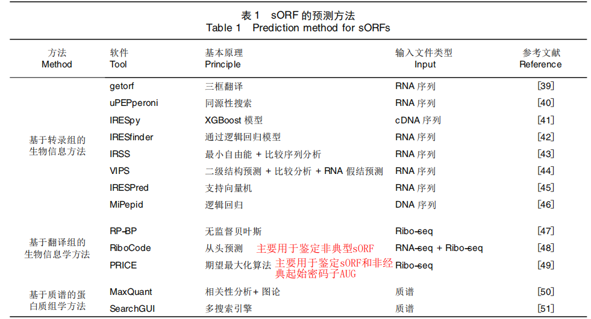

nt:碱基

1.氨基酸是蛋白质的基本组成单位

2.核酸包含 DNA （脱氧核糖核酸 ）（A-T G-C)，RNA（核糖核酸）(A-U G-C)，由核苷酸单体聚合成。

3.核苷酸由 五碳糖、磷酸基、含氮碱基 组成 	

4.DNA上由编码基因和结构基因，编码基因：能够转录信使RNA的部分，它能够合成相应的蛋白质 。

<!--more-->

> 将基因从DNA转录成RNA，可以是具有**直接功能的非编码（ncRNA）**，或者是随后翻译成蛋白质的中间**信使（mRNA）**。 

**带有遗传信息的DNA片段称为基因。**

5.非编码RNA  （ncRNA）（Non-coding RNA）是指不编码蛋白质的RNA。其中包括rRNA，tRNA，snRNA，snoRNA 和microRNA 等多种已知功能的 RNA，还包括未知功能的RNA。 

6.短肽（小肽）SEPs：短肽(short peptides)是由短的小开放阅读框(small open reading frame)翻译生成的肽链, 长度多在100个氨基酸以下.（SEPs是指由mRNA或非编码RNA(non coding RNA, ncRNA)上的sORF翻译生成的短肽, 长度多在100个氨基酸以下.）

经典起始密码子：AUG;相似起始密码子：CUG,GUG;其余起始密码子

7.*CDS*是编码*序列*（Coding sequence） :mRNA上编码蛋白的序列.**CDS，是编码一段蛋白产物的序列。** 

8.Kozak序列：Kozak序列是位于真核生物mRNA 5’端帽子结构后面的一段核酸序列，通常是GCCACCAUGG，它可以与翻译起始因子结合而介导含有5’帽子结构的mRNA翻译起始。对应于原核生物的SD序列。存在于真核生物mRNA的一段序列，其在翻译的起始中有重要作用。 

9.多顺反子：①[原核生物](https://baike.baidu.com/item/%E5%8E%9F%E6%A0%B8%E7%94%9F%E7%89%A9)mRNA常以多顺反子（见）的形式存在，即一条mRNA链编码几种功能相关联的蛋白质。真核生物mRNA一般以[单顺反子](https://baike.baidu.com/item/%E5%8D%95%E9%A1%BA%E5%8F%8D%E5%AD%90)的形式存在，即一种mRNA只编码一种蛋白质。 

10.ORF：开放读码框是从一个起始密码子开始到一个终止密码子结束的一段序列；**不是所有读码框都能被表达出蛋白产物，或者能表达出占有优势或者能产生生物学功能的蛋白。** 

**CDS，是编码一段蛋白产物的序列。** 

**CDS 必定是一个 ORF 。但也可能包括很多 ORF 。**

 **反之，每个 ORF 不一定都是 CDS 。** 

**外显子与 CDS 区不是完全一致的，CDS 区一定属于外显子，但是外显子不一定是 CDS 区，也就是说外显子不一定都能翻译成蛋白的。** 

基因 DNA 分为编码区和非编码区，编码区包含外显子和内含子，一般非编码区具有基因表达的调控功能，如启动子在非编码区。

编码区则转录为 mRNA 并最终翻译成蛋白质。 外显子和内含子都被转录到 mRNA 前体 hnRNA 中，当 hnRNA 进行剪接变为成熟的 mRNA 时，内含子被切除，而外显子保留。实际上真正编码蛋白质的是外显子，而内含子则无编码功能。 内含子存在于DNA 中，在转录的过程中，DNA 上的内含子也会被转录到前体 RNA 中，但前体 RNA 上的内含子会在 RNA 离开细胞核进行翻译前被切除。 

 


同义替换(不含氨基酸变化的核苷酸替换)

非同义替换(含氨基酸变化的核苷酸替换)

## 植物小开放阅读框编码肽的研究进展  

小开放阅读框( small open reading frame，sORF) 一般指基因组中能够编码长度在 100 个氨基酸左右或以内短肽的开放阅读框。具有编码能力的核酸序列。位于RNA上，通常由一串有义密的码子连接而成，以起始 密 码 子 ( AUG) 开 始，以 终 止 密 码 子 ( UAG、UGA、UAA) 结束	

**部分sORF可能不会翻译出SEPs**

sORF的分类：1.来自于非编码RNA（ ncRNA ），2.来自于mRNA

ncRNA

​	lncRNA：转录本长度大于200个核苷酸且不含有大于100个氨基酸的ORF，含有>200核苷酸的RNA分子被归类为长ncRNAs (lncRNAs)，	 

- 主要存在于细胞核中
- 与mrna不同的是，大多数lncrna是细胞或组织特异性的
	 与蛋白质编码mrna一样，lncrna是由RNA聚合酶II酶转录的​	

  ```
  circRNA：具有闭合环状结构，主要定位于细胞质，一些环状rna甚至被发现生成含有>100氨基酸的蛋白质
  
  pri-miRNA：产生成熟microRNA，初级miRNAs (pri-miRNAs)是经过细胞核酶切产生成熟miRNAs的**前体ncRNAs**，也被证明能编码多肽
  ```

大多数miRNA双链被DCL1处理并运输到细胞质中，形成rna诱导沉默复合体(RISC)，介导靶mrna的抑制。然而，一些含有小orf的pri-  mirna可能不经加工就被运输到细胞质中，然后被翻译。

> microRNA 是一类21~23 nt 的小RNA，其前体大概是70~100 nt 左右，形成标准的stem 结构，加工后成为21~23 nt 的单链RNA。microRNA 的作用机制是与mRNA 互补，让mRNA 沉默或者降解。现在流行的RNAi 技术就是利用了细胞体内的这个机制，在体外人工加入类似microRNA 的smallRNA 来沉默对应的mRNA 




大多数编码rna包含一个长ORF和许多短ORF，其中长ORF通常编码一个功能蛋白。然而，编码隐藏肽的假定ncrna只包含短的orf，通常包含小于300个核苷酸，而这些最长的orf通常不负责编码功能性肽，这使得预测编码隐藏肽的orf变得困难。


TP: 实际真 预测真

TN：实际假 预测假

**FP：实际假 预测真**    （假阳性）

FN：实际真 预测假		（假阴性）


##### Ribo-seq

核糖体印迹测序技术（Ribo-seq）

翻译组测序是指对与核糖体结合的正在翻译的RNA片段进行测序，来准确获取样本中所有可翻译分子（包括mRNA和其他潜在可翻译RNA分子如lncRNA, circRNA等）的信息与精确定量，是连接转录组与蛋白质组之间的桥梁。Ribo-seq (Ribosome profiling sequencing)是最常用的一种翻译组测序技术，该技术利用RNA酶消化细胞中的RNA，得到被核糖体保护的正在翻译的RNA片段（ribosome footprints, RFs），然后对这些RFs进行富集、测序与分析。翻译组测序可以研究细胞内基因翻译的水平、区域、速率等，结合转录组、小RNA测序、蛋白组等进行关联分析，可以更精确地研究转录后调控、翻译调控机制。

##### RNA-seq

RNA-seq即[转录组测序](https://baike.baidu.com/item/转录组测序/486410)技术，就是用[高通量测序](https://baike.baidu.com/item/高通量测序/6943039)技术进行测序分析，反映出mRNA,smallRNA,noncodingRNA等或者其中一些的表达水平。

##### MS

质谱

主要用于蛋白质、核酸等生物大分子的分析鉴定的一类质谱法。


## smORFer: a modular algorithm to detect small ORFs in prokaryotes	

它在原核生物中具有很高的准确性来检测假定的smORFs。

该算法以模块化的方式执行，根据特定生物体的可用数据，可以选择不同的模块进行smORF搜索

### 数据集

Gene Expression Omnibus (GEO) repository 

### 工作流程

模块A的第一部分需要定义所有假定的orf的边界。

模块B和模块C进一步增加了检测到的smORF候选的置信度，可以单独执行或一起执行;后者增加了真阳性新smORFs的检测。

A:通过基因组序列，包含一个用于选择区域的链特定过滤器，为了检测一个假定的smORF是否可能编码多肽或蛋白质，即显示CDS的3-nt序列周期性，从而可能被翻译，我们使用傅立叶变换

B:从Ribo-Seq数据中检测翻译的orf，包括读取处理。该校准程序为每个RPF分配密码子在核糖体A或P位点，允许跟踪核糖体沿orf的密码子周期步伐。

C:检测TIS.TIS-Ribo-Seq的处理方法与Ribo-Seq相同。每个RPF的中间核苷酸被提取并用于进一步分析;

