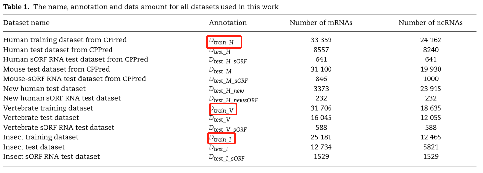
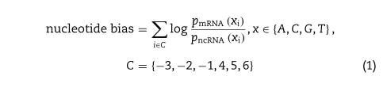
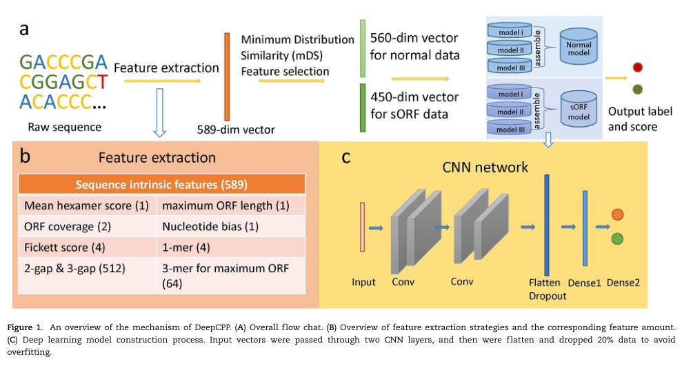
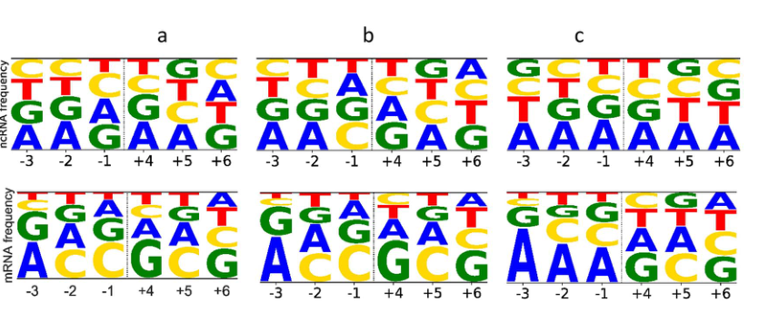
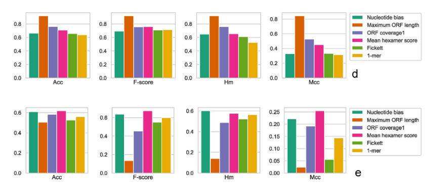
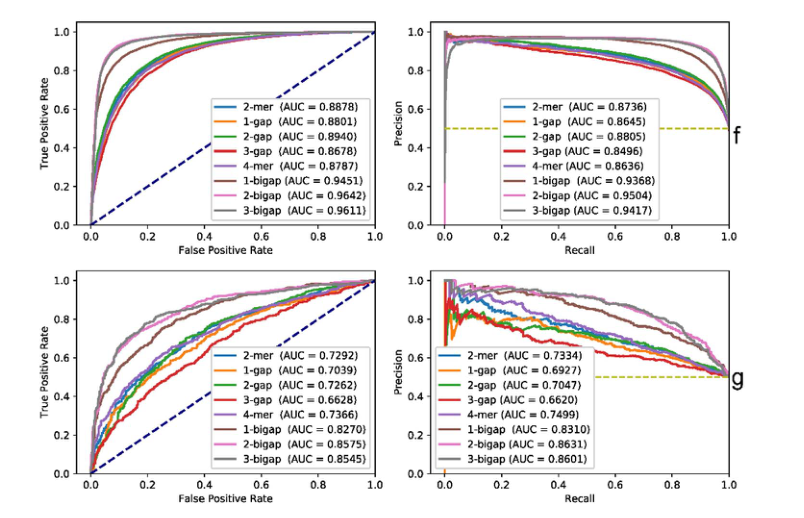
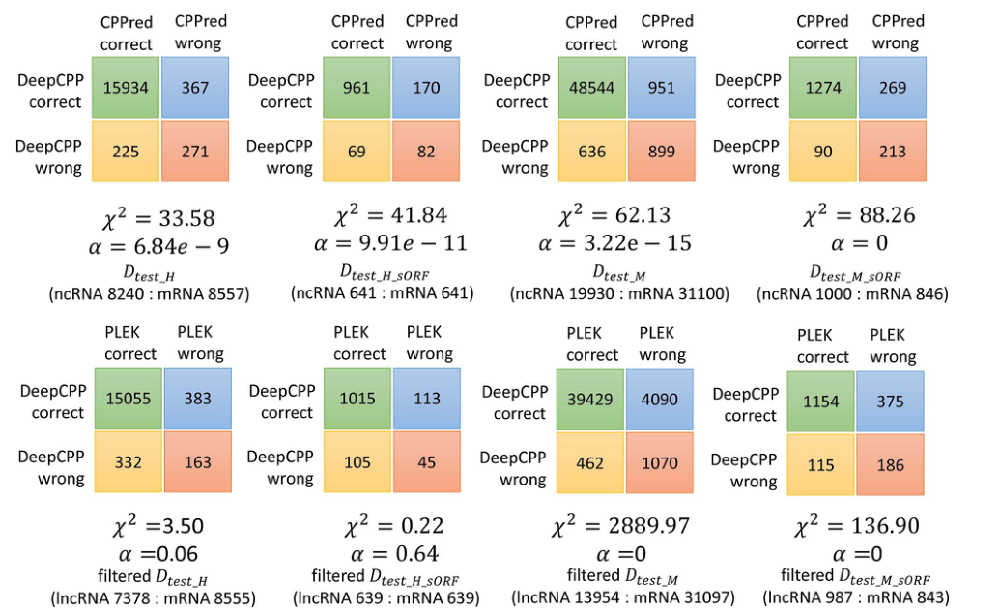

## DeepCPP: a deep neural network based on nucleotide bias information and minimum distribution similarity feature selection for RNA coding potential prediction

现有方法在区分大多数长非编码 RNA (lncRNA) 和编码 RNA (mRNA) 方面表现良好，但在具有小开放阅读框 (sORF) 的 RNA 方面表现不佳。

一种用于RNA编码潜在预测的深度学习方法

目标是建立一个有效的模型来预测RNA编码潜能，特别是具有sorf的RNA。

在该文章中，将含有可编码潜能sORF的RNA都视为mRNA，ncRNA为非编码RNA。

在普通数据集中为，mRNA为含有ORF的mRNA

在sORF数据集中，mRNA为只含有sORF的mRNA

<!--more-->

关键点 
-我们提出了一种新的特征表示方法，即**核苷酸偏倚**，这在sORF RNA编码潜力预测中是很有用的。
-我们开发了一种新的特征选择方法**mDS**，在这项工作中被证明是有效的。
-在人类、脊椎动物和昆虫数据集上对DeepCPP和其他最先进的方法进行了综合比较，突出了DeepCPP在RNA编码潜能预测中的优越性，特别是在sORF RNA数据上。

### 数据集

### 特征提取

不连续k-mer,核苷酸偏倚和最小分布相似性特征选择方法

最长的开放阅读框和k-mer是最常用的特征。因为转录本中较长的ORF区域更有可能被翻译成蛋白质，而k-mer可以反映序列的一些内在特征。

此外，one-hot vector、二级结构和网络学习特征也被应用于lncRNA与mRNA的分类中。

新的特征表示方法，即核苷酸偏倚，它反映了起始密码子周围的信息，并被证明在sORF型RNA的区分中是有用的

不连续的k-mer，即g-bigap(双核甘氨酸之间有间隙)，比连续的k-mer具有更好的ROC和PRC曲线。

**新的特征选择方法——最小分布相似度(mDS)**

最后，利用上述策略和其他有用的特征表示方法，如六聚体评分、ORF覆盖和ORF长度

整个特征集包含 589 个特征（六聚体得分（1）ORF 覆盖率（2）最大 ORF 长度（1）核苷酸偏差（1）Fickett（4）1-mer（4）2-bigap（256）3-bigap（256） ) 帧内 3-mer(64))。

##### 核苷酸偏倚

核苷酸偏倚特征反映了起始密码子周围的整体信息。

核苷酸偏倚是我们新提出的特征表示方法。虽然起始密码子表示翻译的起始，但翻译不一定从它开始。

已有研究表明，起始密码子周围的核苷酸在一定程度上影响翻译起始的调控。

起始密码子(核苷酸位置:−3，−2 and−1)和(核苷酸位置:+4，+5 a n d+6)之后。编码序列中的起始密码子具有明显的核苷酸偏好。例如,位置−3倾向于A / G和位置+ 5倾向于C。起始密码子附近的某些核酸，如−3 ~ −1和+4 ~ +6位点，可能有助于增强翻译起始。报道的真核生物各分类群的物种的核苷酸模式有较高的相似性，−9 ~ +6位置的G值较高，特别是−3 ~ +6位置。

基于上述生物学发现，我们提出了一种新的区分mrna和ncrna的特征编码方法，即核苷酸偏倚。

我们计算了mRNA和ncRNA训练数据集中最大ORF起始密码子周围i位置的x核苷酸的频率。

核苷酸偏倚的计算方法如下:

*先根据总的数据集，计算得到-3位置ACGT各核苷酸频率，-2位置ACGT各核苷酸频率......,然后对于具体的某个数据计算核苷酸偏倚特征值，例如-3位置为A 计算log (pmRNA(A-3)/pncRNA(A-3))这个的比值，-2位置为G 计算log(pmRNA(G-2)/pncRNA(G-2) )这个的比值，然后求和-3~+6各值的和，*

##### mDS

从上面的部分，我们有5个特征编码方案，总共589个特征。然而，有些特征可能包含噪声信息，有些甚至对模型性能不利，因此需要进行特征选择以提高精度(Acc)，同时降低时间复杂度。在这里，我们提出了一种新的特征选择方法，该方法旨在根据特征的潜在贡献对特征进行排序，以区分两个类，我们将其命名为mDS。

通过相对熵来大致衡量其原始公式如下:

本文通过考虑实现最大Acc的特征子集大小，在相应的测试数据集上进行验证，确定小bin number的值。将D = D(p||q) + D(q||p)作为根据特征重要性进行排序的标准。

采用q(x) = 1/number of class II 代替q(x) = 0  ,(意思是如果在这个选取的bin中，q(x)=0,那么就用 1/总体II类的数量 来代替0？）

由于mDS提供的是特征排序，而不是明确的最佳特征子集，因此应通过交叉验证确定特征子集的大小。

### 模型构建

由于正常数据和sORF类型数据之间的差异，对于人和另外两个物种，我们都分别建立了两个模型，一个用于预测正常数据，另一个用于预测sORF类型数据。每组两个模型使用相同的训练数据但不同的特征子集进行训练

> model1 model2 model3 是集成学习

此外，由于参数在深度网络中是随机初始化的，我们通过平均得分将三个模型组合成一个，并使用阈值0.5（每个模型的输出得分从0到1标准化）在DeepCPP中做出决策

DeepCPP机制的概述如图1所示。首先，从原始序列中提取特征，然后将mDS特征选择方法应用于完整的特征集，以减少CNN中大量参数引起的复杂性和潜在的过度拟合，将正常和sORF数据的560和450个特征放入深度网络进行评估。输入向量通过两个CNN层，然后被展平并丢弃20%的数据，以避免过度拟合。最后，将输出组装结果并给出预测标签。

##### 模型评估

单个特征提取，进行分析，看该特征是否有效对分类能产生一定影响。

以Acc、敏感性（Sn）、特异性（Sp）、Sn和Sp的调和平均值（Hm）、F评分和马修相关系数（Mcc）为标准评估模型的性能。此外，采用McNemar检验从各自的统计数据对两个模型进行比较。

即表示可编码RNA上的sORF具有明显的核苷酸偏移，ncRNA上没有核苷酸偏移特征。

结果表明，核苷酸偏倚特征确实对区分mRNA和ncRNA有一定影响，但它对正常测试数据集（Dtest_H）和性能的影响不是很理想，因为最大ORF长度、ORF覆盖率和六聚体分数三个特征的Acc值比它高。

然而，核苷酸偏差是区分sORF型RNA序列的一个重要特征

Dtest_H_sORF度量中所有指标的前两个最大值属于核苷酸偏倚和六聚体分数，其中所有其他特征的Acc低于60%，尤其是最大ORF长度特征，该特征在评估正常测试数据集方面表现突出，但在sORF数据集上表现不佳，Acc仅为50.62%，F分数，Mcc和Hm值非常小。

在两个测试数据集上，g-bigap特征集的表现优于其他特征集，AUC值更高。特别是与连续k-mer相比，2-bigap和3-bigap特征集的优势极为明显。

这里的研究结果表明，g-bigap可以成为mRNA和ncRNA分类的一个重要特征。

### 特征选择

整个特征集包含 589 个特征（六聚体得分（1）ORF 覆盖率（2）最大 ORF 长度（1）核苷酸偏差（1）Fickett（4）1-mer（4）2-bigap（256）3-bigap（256） ) 帧内 3-mer(64))。

分别为 normal 和 sORF 模型选择了 bin 数为 1000 和 100，以最小的特征子集大小实现了最好的 Acc

为了说明 mDS 的有效性，我们还研究了其他常用过滤器特征选择方法的性能，例如 mRMR [41]、F-score、mutual information、Pearson 相关和 Max-Relevance-Max-Distance (MRMD) [ 37] 在相同的测试数据集上进行比较。这些方法的最佳特征子集的截止点是通过对 Dtest_Hand Dtest_H_sORF 的验证来选择的。使用按不同特征选择方法排序的前 n 个特征以及 n 的选择在这两个数据集上运行五次的平均 Acc。

对于正常数据，Fscore、Pearson  correlation和MRMD确定的特征子集的Acc在初始时快速增加，并且在特征子集大小小于510时高于mDS，但这些方法实现最大Acc的特征子集大小分别为570、555和525，与mDS的560相当。对于sORF类型的数据，除了mRMR的性能比其他方法差得多外，所有其他方法的趋势和性能都是可比的，但mDS以最少的特征数量实现其最大Acc，即。E450，而其他方法通过485至565功能实现其最大Acc。

##### DeepCPP人体模型评估

实施 McNemar 检验以进一步比较模型。

 DeepCPP 四个先前和两个新测试数据集上的表现说明了 DeepCPP 在对 lncRNA 和 mRNA 进行分类方面的有效性，尤其是对于带有 sORF 的 RNA。

包括Hugo的SVM方法[17]、mRNN[20]、lncRNAnet[22]、LncADeep[23]、LncFinder[24]、RNAsamba[25]和CPPred[21]。上述七种方法都是基于机器学习的，其中三种使用支持向量机模型，四种使用深度学习模型，它们采用了多种特征表示方法，如**最长ORF相关特征、k-mer、one-hot vector、网络学习特征**等。

DeepCPP 对 可编码小肽的ncRNA，能将其识别为mRNA，体现了一定的可塑性。

##### 集成模型

与人类模型类似，我们还为脊椎动物和昆虫物种建立了正常和sORF模型。小鼠和斑马鱼数据用于训练脊椎动物模型，果蝇和蚊子数据用于训练昆虫模型。用于集成模型的特征子集与人体模型的特征子集相同。除了训练物种的新数据外，测试数据还包括来自猪、狗和蜜蜂等新物种的数据。我们将 DeepCPP 脊椎动物模型与 Hugo 的 SVM 方法 [17] 和 CPPred [21]（图 4A 和 B）进行了比较，它们具有由小鼠和斑马鱼样本训练的集成模型，并将昆虫模型与 CPPred [21]（图 4C 和D) 其集成模型使用昆虫物种数据（如果蝇和线虫）进行训练。

### 总结

在这项工作中，首先，我们引入了一种新的特征表示方法，即核苷酸偏置。此外，发现g-bigap特征表示在蛋白质编码潜力预测中至关重要，特别是对于sORF类型的数据，但以前的工作只解决了连续k-mer的有效性，而忽略了不连续的k-mer的影响。然后，我们提出了一种新的特征排序方法，即mDS，它在本工作中在数据集上的成功应用以及比mRMR的优越性突出了它在选择特征上的价值。最后，基于新的特征和其他有用的特征，结合mDS方法选择特征子集和集合CNN神经网络，我们开发了DeepCPP来预测RNA序列的编码潜力。

### 启发

1.lncRNA上可编码sORF有没有核苷酸偏置

2.mDS特征选择

3.该文考虑g-gap 以及 bigap 有没有可能 三核苷酸gap 有特征