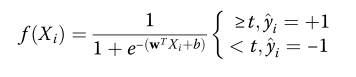

## MiPepid：使用机器学习的小肽识别工具

一个基于ML的工具，专门用于直接从DNA序列中识别小肽

<!--more-->

### 数据集

> sORFs.org是专门从Ribo-Seq和MS数据中识别出的小型orf库
> SmProt是一个从文献挖掘、已知数据库、核糖体分析和MS中收集的小肽数据库
>
> 为了收集具有代表性而又简明扼要的小肽的阳性和阴性数据集，我们选择了2个数据源:SmProt和传统非编码rna
> SmProt高置信度数据集（共包含12602条人类小肽）是一个可靠的阳性数据源
> 传统的非编码RNA，如microRNA（miRNA）、核糖体RNA（rRNA）、小核RNA（snRNA）
>
> 选择人类的miRNA、rRNA、snRNA、snoRNA（小核仁RNA）、tRNA（转移RNA）和scaRNA（小Cajal体RNA，一种核仁RNA）作为阴性数据集的数据源。
>
> 为了进一步测试我们方法的性能，我们生成了一个合成数据集，它保留了阴性数据集的长度分布以及二核苷酸频率[38]。由于这个数据集模仿了阴性数据，我们的方法有望在这个数据集上预测阴性。这个合成的阴性数据集与阴性数据集的大小相同（2936），它是用MEME套件中的ushuffle软件生成的。

SmProt是一个从文献挖掘、已知数据库、核糖体分析和MS中收集的小肽数据库
数据处理
阳集处理
1）获得数据的核苷酸序列
在SmProt中，只提供了氨基酸序列而不是DNA序列
通过使用GeneWise将蛋白质序列映射到其相应的转录本上，获得相应的DNA序列。为了保证数据集的质量，只保留了完全匹配的小肽（没有替换或差异）
2）获得一个非冗余的阳性数据集
具有相似序列的蛋白质可能具有相似的功能，而相关序列的家族会对某些序列特征产生偏倚。我们选择了一个蛋白质序列一致性≤0.6的非冗余数据集。这就是我们的阳性数据集，它包含4017个数据点。
阴集处理
在Ensembl数据库中选择所有人类转录本，并从这些转录本中提取了所有可能的ORF，即具有有效起始和终止密码子的ORF。为了确保我们数据集的有效性，我们在构建阴性数据集时只考虑ATG起始密码子。在阳性数据集中，近99%的sORF以ATG起始密码子开始
我们最终收集了5616个阴性sORFs。按照与阳性数据相同的方法，选择了一个大小为2936的非冗余阴性数据集，其成对预测的蛋白质序列一致性≤0.6。

### 特征提取

K-mer   k取4
为了更好地捕捉翻译框架的密码子信息，我们选择了步长为3的k-mer提取

### 模型构建

逻辑回归

### 模型评估

ACC，F1  