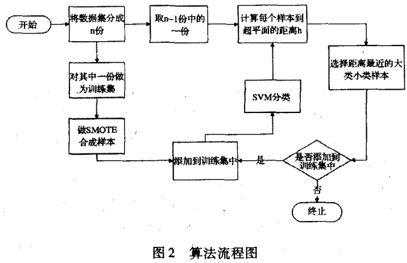
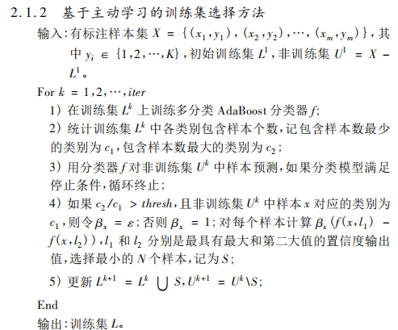
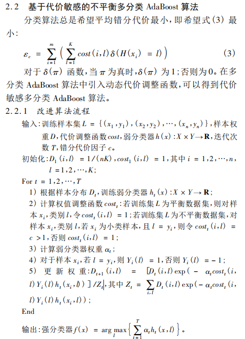
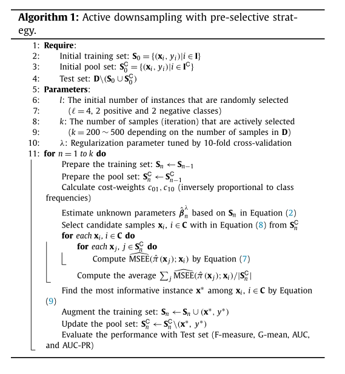

# 1. 目前有没有结合生物特征做不平衡数据处理的相关文献

1.作者利用GAN设计编码蛋白的人工DNA序列：以服从低维正态分布的向量作为生成器的输入，生成器产生的DNA序列与来自Uniprot数据库中超过3655条的天然蛋白编码序列共同作为判别器的输入，训练GAN生成编码蛋白的人工DNA序列。

2.基于VAE的生成式模型引入小分子药物序列的设计中。2018年Lim等使用化合物的油水分配系数、氢键供体性质等性质作为条件向量输入，利用分子序列与条件向量成对输入到VAE中，最终生成了分别达到5类不同理化性能指标的人工化合物分子。

3.利用基于LSTM的模型形成通用的蛋白序列表示空间，并利用该表示空间与绿色荧光蛋白的荧光强度模型相结合，进行绿色荧光蛋白序列的人工设计。

目前多用于化合物分子团等单元数目较多的生物序列的生成。

针对小开放阅读框的样本生成，即生成的样本之间相似度过高，影响人工生物序列的多样性。循环神经网络可灵活处理不定长的生物序列，但通常模型规模大，所需训练时间长，且生物分子序列相比于自然语言生成的场景，缺乏成熟的语义嵌入网络。

## 2.目前也有很多文献做不平衡数据的主动学习 问我这个有什么改进优势

目前的一些针对不平衡数据的主动学习没有考虑到生物序列特征方面的相关特性，针对sorf 正集分布在较长区间，负集分布在较短区间。


## 3.然后建议我用结合生物序列结构的方式，不一定非用p-nts编码 那种方式

p-nts 不能生成长度一致的向量必须用“n”或“0”填充以获得长度一致的向量。

k-mer频率，作为输入向量


## 基于主动学习SMOTE的非均衡数据分类

张永 2012 计算机应用与软件

<!--more-->



选一份 进行smote数据平衡，训练SVM分类器，循环其他份查询选择相同数量正负集添加进训练集

## 基于不平衡数据集的主动学习分类算法

赵小强 2019 控制工程 

**基于改进** **SMOTE** **的主动学习** **SVM** **分类算法**

与张永基本一样 ， 

提出根据 各个样本的归属值，投票权和累计投票权，选择样本合成

## 基于采样技术的主动不平衡学习算法研究

李青雯 2018 电子设计工程

与传统主动学习相比，完成查询样本添加样本后，多出了一个平衡控制过程，对样本采用提出的BOS样本采样策略

BOS

随机选择$\lambda N^{+}$少量样本 置于数据集S^+Neighbor^中，从中随机选一个x主样本，再在S中找x附近K个样本，随机选一个做x'，x^new^=x+rand*(x'-x)

## 面向类别不平衡数据的主动在线加权极限学习机算法

王长宝 2017 计算机科学

AOW-ELM算法

在主动学习过程中﹐新标注样本显然是以增量的方式进行添加的,因此可采用以下两种方式之一对分类器进行迭代更新:1)首先将新标记样本添加到已标记样例集中,然后采用全部已标记样本训练一个新分类器;2)采用增量学习算法,即仅利用新的已标记样本对分类器进行微调和更新。显然,在上述两种方式中,后者比前者更省时,尤其对于大规模数据集而言更是如此。

本文采用第二种方法

给不同样本分配不同权重

```
1.统计并保留L中少数类与多数类的样本数,分别记为|N+|和|N一l;
2.利用式(25)计算初始的加权矩阵W;
3.训练初始的加权极限学习机分类器S,并得到初始的隐层输出矩阵β﹔
4.删除有标记样本集L;
5.调用AL-ELM算法的查询样本规则在U中找到一个具有最大不确定度的无标记样本子集V,其中V包括P个样本,并将该子集提交给人类专家进行手动标注;
6.U=U一V;
7.统计V中少数类与多数类的样本数﹐并分别对已保留的/N+|和|N-|进行更新,同时利用式(25)计算出V中每个新添加样本的权重,构建新的权重矩阵W;
8.利用式(24)对隐层输出矩阵β进行更新并得到更新的极限学习机分类器S;
9.删除新标注样本集V;
10.判断是否达到预设的停止条件﹐若是,则退出﹐并输出最后的分类
器S;若否,则返回第5步,继续执行。
```

## 基于主动学习不平衡多分类 AdaBoost 算法的心脏病分类

王莉莉 2017 计算机应用

在不确定性采样 margin方法添加参数β，即$x^*=arg min(\beta_{x}(f(x,l_1)-f(x,l_2)))$

$\beta_{x}$为数据平衡控制因子，目的是保证类别之间的数据平衡性。





## Downsampling for Binary Classification with a Highly Imbalanced Dataset  Using Active Learning

1.代价敏感方法的惩罚Logistic回归
$$
l(\beta;S) = \sum_{i=1}^{n}{[c_{01}y_ilog(\pi(x_i))+c_{10}(1-y_i)log(1-\pi(x_i))]}
$$
2.均方估计误差(MSEE)


3.采用预选策略的主动下采样

算法流程



