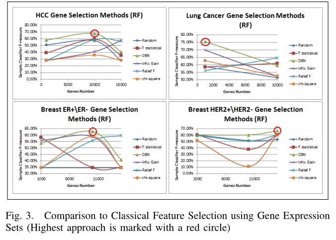

**Multi-Level Gene/MiRNA Feature Selection using Deep Belief Nets and Active  Learning**

## 摘要

选择最具鉴别性的基因/miRNAs已被提出作为生物信息学的一项重要任务，以增强疾病分类器和缓解维度诅咒问题。原始的特征选择方法是根据基因/miRNAs的个体特征来选择它们，而不考虑它们如何共同表现。考虑群体特征而不是个体特征为选择信息量最大的基因/miRNAs提供了一个更好的视角。最近，深度学习已经证明了它在多个抽象层次上表示数据的能力，允许更好地区分不同的类。然而，利用深度学习进行特征选择的思想在生物信息学领域还没有得到广泛的应用。本文提出了一种基于表达谱选择基因/miRNAs的多层次特征选择方法MLFS。这种方法基于深度学习和主动学习。此外，通过考虑miRNAs和基因之间的生物学关系，提出了将该技术用于miRNAs的扩展。实验结果表明，该方法对肝癌(HCC)、肺癌和乳腺癌的f1指标均优于传统特征选择方法，分别提高9%、6%和10%左右。结果也显示了我们的方法在f1  -测度中比最近在[1]和[2]中相关工作的增强。

<!--more-->

## Introduction

先前的研究([3]，[4])表明基因表达谱和疾病类型/亚型之间有很强的关系，使用基因表达集来检测或区分癌症或其亚型。基因表达集存在维数诅咒问题，这是由于基因数量多、样本数量少而造成的。为了解决这个问题，文献中提出了几种特征选择方法来选择一个子集的基因用于分类癌症或其亚型([1]，[2]，[5]，[6])。此外，特征选择方法可以在分类阶段剔除可能产生噪声的不相关基因，从而提高分类模型的执行时间、大小和准确性。

本文将深度学习和主动学习结合起来。我们的**目标是用最少数量的最具识别力的基因来提高分类精度**。近年来，深度学习在图像、音频等领域得到了广泛的应用。深度信念网(Deep  Belief Net, DBN)是应用深度学习的一种算法。它也显示了其检测高水平特征和提高分类精度的能力。据我们所知，它首次被用于[1]，以增强基于基因表达谱的癌症诊断和分类。另一方面，原始特征选择方法([1]，[5]，[6])仅基于基因表达谱来选择用于检测癌症或其亚型的基因，而不考虑基因组如何一起执行。我们的方法通过主动学习缓解了这个问题。传统的主动学习[7]是一种半监督机器学习方法。它通常用于未标记数据非常丰富，但手动标记成本很高的情况。最初的主动学习方法是从训练一个带有小样本集的分类器开始的。本文介绍了主动学习在无监督情况下的一种扩展。

此外，我们的方法被扩展到处理miRNA特征选择问题。MicroRNAs  (miRNAs)是短的(19-25个核苷酸)非编码单链RNA分子[8]，在转录或翻译水平上调节基因表达[8]。在本文中，我们的方法通过利用miRNA靶基因的生物学关系，利用多层次基因特征选择方法，扩展到miRNA特征的选择。

论文的组织如下:第二节讨论了相关工作，第三节详细描述了所提出的方法，第四节展示了实验结果。最后第五部分对全文进行总结。

## RELATED WORK

近年来文献中提出了许多基因特征选择方法，如([1]，[2]，[5]，[6])。作者在[5]中采用地形滤波特征选择方法，并使用SVM分类器对样本进行判别。[6]的工作使用了特征选择方法的集合，以提高特征选择的稳定性和分类精度。然而，基因的评估是独立的，而不管它们在一起表现如何;这个问题在我们提议的主动学习阶段得到解决，如下一节所示。同样，这个问题在[2]中得到了解决。[2]的作者没有单独考虑基因表现，而是与其他基因共同评估其表现。然而，我们的方法通过使用DBN特征和主动学习来评估联合基因的表现。

深度学习最近在图像和音频应用([9]，[10])等几个领域得到了广泛的应用。本文采用DBN来寻找高水平更好表达的基因表达集。[1]通过解释一个自动编码器来使用深度学习来执行降维，然后使用DBN与新的维数来分类样本。在我们的方法中，基因没有首先映射到主成分，因为我们想跟踪最具鉴别性的基因，以便生物学家能够找到它们与疾病的关联。

在下一节中，将详细描述拟议的方法MLFS，展示其主要组件以及如何将其扩展到与miRNAs一起工作。

## THE PROPOSED MLFS 方法

### a.系统概述

如图1所示，基因特征选择方法由三个主要组成部分组成:

•Deep Belief Net:  DBN[11]用于生成捕获它们的相互作用和行为的基因的高水平表示。

•特征选择:然后特征选择应用于DBN生成的高水平表示，以选择一个子集的基因。

•无监督主动学习:无监督主动学习通过选择提高分类精度的基因来减少基因子集。

此外，对该方法进行了扩展，用于miRNA特征选择，如图2所示。下面的小节详细解释了所提议的方法的每个组成部分。

### b.深度信念网与特征选择

dbn被定义为图形模型，它可以学习提取训练数据的深层层次表示。我们使用[11]中提出的培训程序和[12]中的开源库实现。本文使用的深度学习库有两个隐藏层，每一层的神经元数量等于输入层的原始特征。

特征选择步骤应用于DBN生成的高级特征。在这一步中，可以采用任何合适的特征选择方法，如统计t检验或relief-f。试验结果部分采用统计学t检验和relief-f检验。

### c.总体MLFS方法

提出的多层特征选择方法用于对用于区分癌症类型/亚型的样本分类器进行特征选择。我们的目标是用最少的基因数量来提高分类的准确性。该方法的步骤描述如下:

1)利用DBN提取基因表达谱(e)的高水平表示(e’)。

2)对高水平表示(e)应用经典特征选择方法，并根据其得分(如统计t检验中的p值)对基因进行排序。

3)设n为使用的初始随机基因数，g为整组基因，λ为一定百分比，c为分类器，a为精度，Step为每次迭代加入n的基因数，bestGenes为精度最好的一组基因。选择要使用的基因数量如下:

 x=n
•bestGenes= top ranked x genes
•While(x <=λ*|g|):
–c←TrainClassifier(bestGenes,trainingSet)
–a←MeasureAccuracy(bestGenes,testSet)
–If (a > bestAccuracy):
∗bestGenes←top ranked x genes.
∗bestAccuracy←a
–x←x+Step.

4)利用所提出的无监督主动学习方法，应用一个缩减阶段来减少最佳遗传集中的基因数量，从最佳遗传集中选择信息量最大的基因，如下:

a)如果p值< 0.05，则将最佳基因组中的所有基因标记为与癌症类型相关的基因。否则，将它们标记为不相关。

b)使用bestgenes的随机小子集构建一个基因分类器。分类器是用来判断给定的基因是否与癌症类型有关，根据其表达谱。

c)让分类器标记bestgenes set。然后，得到对分类器最有信息的基因，这些基因的分类置信度接近0.5，例如在0.4到0.6之间。

d)使用统计t检验标记信息量最大的基因。这一阶段通常采用人的判断，但没有一个具有强烈生物背景的人的判断。因此，使用了统计学t检验标签。

e)将信息量最大的基因添加到训练集中，重新训练分类器，回到步骤c。

f)使用测试集记录准确性，当接近或高于使用所有bestGenes产生的基因时停止。

### D. MLFS-miRNA: MiRNAs特征选择扩展

为了有效地使用DBN，应该给它提供一个包含大量未标记数据的训练集。然而，mirna的数量通常非常少。这就是为什么提出了一种新的扩展方法，而不是使用相同的多层次特征选择方法。我们的方法通过利用mirna  -靶基因的生物学关系进行扩展，如miRanda[15]数据库。microrna的排序是基于它们在前一个主动学习阶段产生的最终基因特征选择集中存在的目标基因的数量。最后，选择的mirna的数量与前面的方法相同。

## Results

我们的实验结果在四个小节中给出，以显示每个提议的分量对分类精度的影响。在无监督主动学习阶段使用SVM分类构建基因分类器，在样本分类器中使用随机森林分类器构建样本分类器。支持向量机和RF实现都来自Weka存储库[13]。采用6种癌症类型，即乳腺癌、肝细胞癌、肺癌、前列腺癌、结肠癌和卵巢癌，对提出的方法进行评估。表I、II和III显示了数据集的大小。

### a.MLFS评价

提出的方法的前两个阶段(将被称为DBN)首先与五种特征选择方法进行比较。这些是随机(随机选择k个基因)、统计t检验、信息增益、relief-f和卡方，应用于原始表达式。从[14]中使用统计t检验，而从Weka库[13]中使用信息增益、卡方和relief-f。使用F-measure将DBN方法与之前的方法进行比较。如图3所示，DBN方法能够在所有方法中获得最高的F-measure。

### B.无监督主动学习

使用无监督主动学习来减少最佳基因集，这是从我们的方法的前两个阶段获得的。表四和表五显示了应用主动学习阶段后的结果。表中显示，在提高或至少保持相同的分类精度的同时，主动学习能够降低最佳遗传集在肺癌中60%，在HCC中20%，在乳腺癌ER+/ER-中50%。

### c.MLFS-miRNA评价

将用于基因表达集的相同的五种特征选择方法应用于miRNA表达谱，并与我们的方法MLFS-miRNA进行比较。图4显示了它们之间的比较。如图所示，miRNA延伸在所有曲线上表现较好。

### D.与相关工作的比较

表III显示了用于比较我们的工作与[1]和[2]的数据集大小。而表VI显示了与[1]比较的10倍交叉验证分类精度结果。此外，我们使用两个数据集SRBCT和MLL[16]来比较我们的方法和[2]中提出的方法。由于统计t检验仅限于2类，它被Weka[13]中的浮雕特征选择所取代。表VII显示了10倍交叉验证结果。

## Conclusion

本文提出了一种融合DBN和主动学习两种无监督机器学习方法的多层次特征选择方法，以选择最少数量的最具鉴别性的基因，提高样本分类精度。实验结果表明，本文提出的特征选择方法在肝癌和肺癌的f1测量中分别比经典特征选择方法提高9%和6%。此外，实验结果表明，与最近的相关工作相比，我们的方法在f1测量方面有提高
