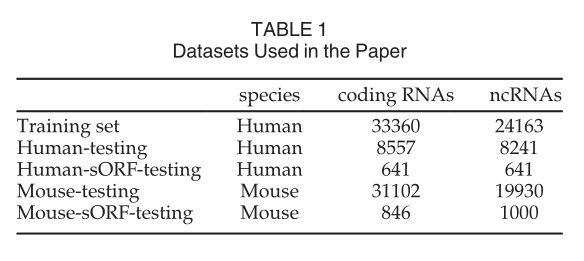
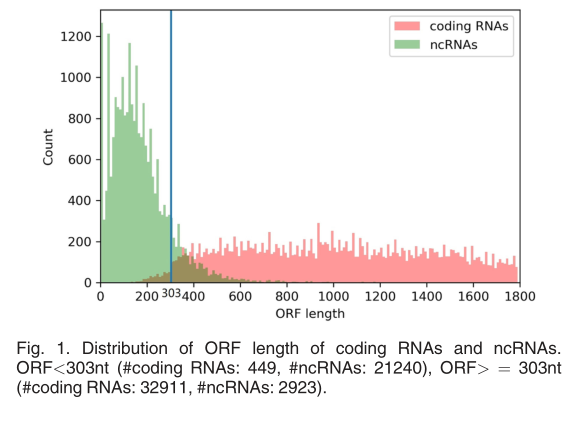
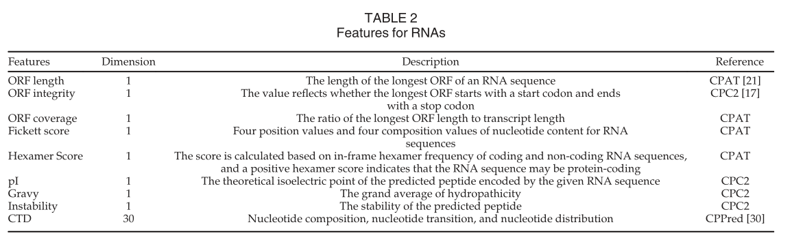
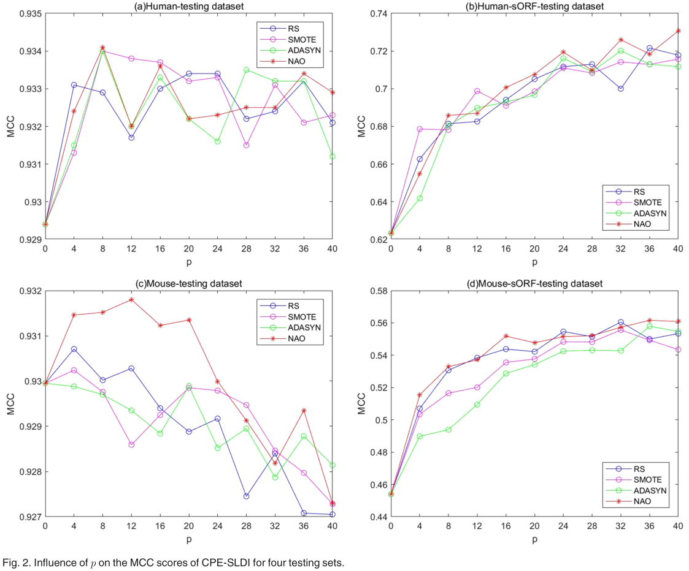
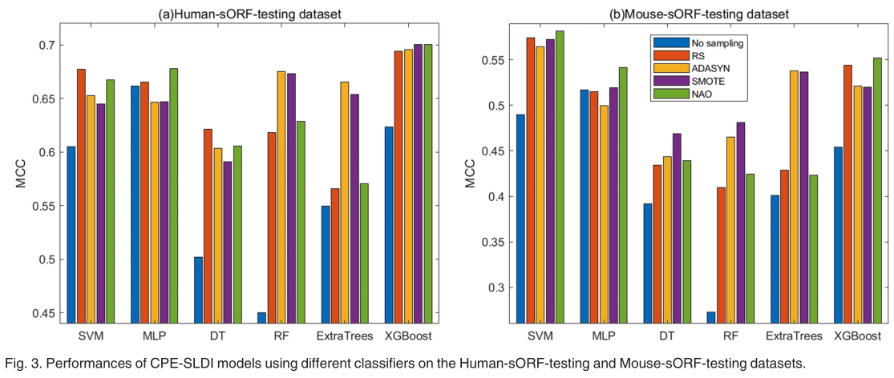
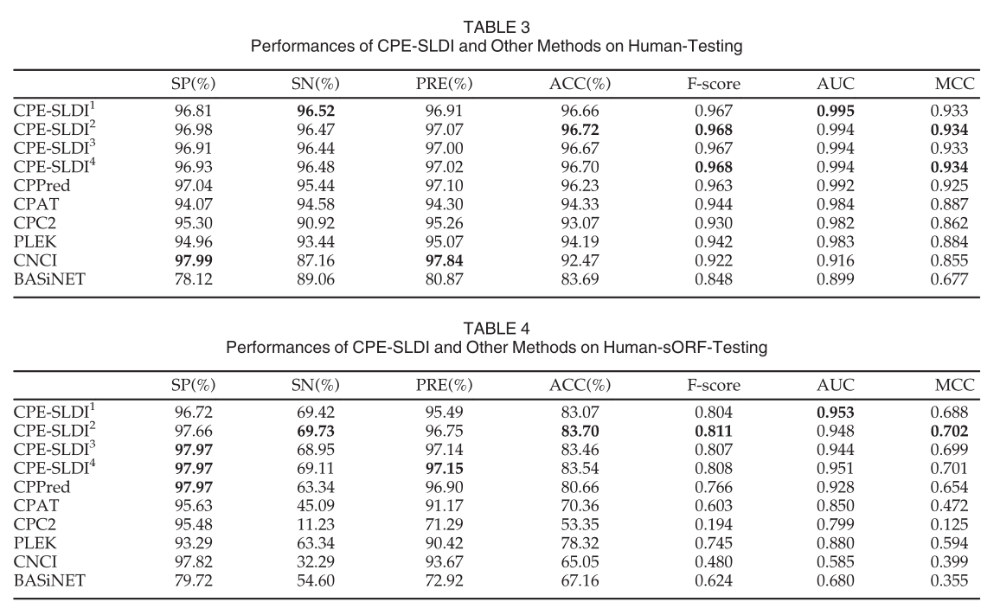
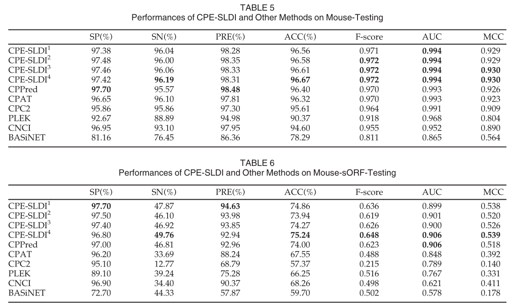
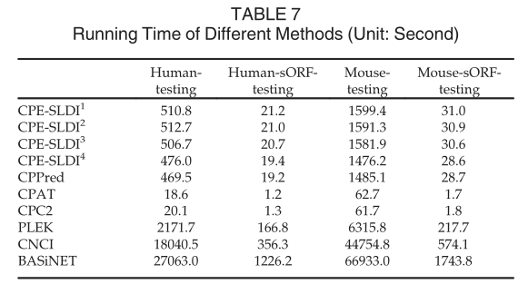
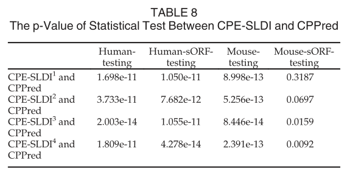

## Predicting Coding Potential of RNA Sequences by Solving Local Data Imbalance

### 摘要

非编码RNA(ncRNAs)在多种生物学过程中发挥重要作用，并与疾病相关。区分编码RNA和ncRNAs，也就是预测RNA序列的编码潜力，是进行下游生物功能分析的关键。已经提出了许多基于机器学习的方法来预测RNA序列的编码潜力。最近的研究表明，现有的大多数方法对开放阅读框架较短的RNA序列(sORF，ORF长度<303nt)的处理效果不佳。在本工作中，我们分析了RNA序列的ORF长度分布，发现具有sORF的编码RNA的数量不足，并且具有sORF的编码RNA的数量远远少于具有sORF的ncRNAs。因此，在含有sORF的RNA序列中存在局部数据不平衡的问题。我们提出了一种编码潜力预测方法CPE-SLDI，该方法使用数据过采样技术来增加带有sORF的编码RNA的样本，以缓解局部数据的不平衡。与现有方法相比，CPE-SLDI具有更好的性能，研究表明，通过各种数据过采样技术进行数据增强可以提高编码潜力预测的性能，特别是对于含有sORF的RNA序列。建议的方法的实施可在https://github.com/chenxgscuec/CPESLDI上获得。

关键字：非编码RNA、编码潜力预测、本地数据不平衡、过采样

<!--more-->

### Introduction

高通量测序技术已经产生了大量的转录本[1]、[2]、[3]。这些转录本是DNA转录产物的组合，包括编码RNA和非编码RNA(NcRNAs)。NcRNA是指不编码蛋白质的RNA，但已被认为在基因表达调控和疾病发病机制中发挥关键作用[4]。区分编码RNA和ncRNAs，也就是预测RNA序列的编码潜力，是进行下游生物功能分析的关键。

机器学习方法已经有许多在生物信息学中的应用[5]、[6]、[7]、[8]、[9]。已经提出了许多计算方法来预测RNA序列的编码潜力[10]，它们使用不同的特征和不同的分类器来建立预测模型。这些特征包括开放阅读框架(ORF)质量、开放阅读框架覆盖率、开放阅读框架完整性、开放阅读框架长度、Fickett分数、等电点、序列的内部组成、多尺度结构信息、物理化学性质[11]、复杂网络的拓扑特征[12]等。常用的分类器包括支持向量机(SVM)、随机森林(RF)、Logistic回归(LR)等。支持向量机是最常用的分类器，已被CPC[13]、CNCI[14]、PLEK[15]、LncRScan-SVM[16]、CPC2[17]和Longdist[18]采用。来[19]和FEElnc[20]使用Rf作为量词。LR用于CPAT[21]。也有几种基于集成学习的方法，如Simopoulos等人的工作[22]，LncRNApred[23]和LncPred-IEL[24]。近年来，深度学习被用于开发预测模型，如LncRNAMFDL[25]、LncRNAnet[26]和LncADeep[27]。

开放阅读框(ORF)是由三部分组成的核苷酸片段：起始密码子、终止密码子以及它们之间的核苷酸片段。有非常有效的方法来识别ORF[28]。ORF长度是RNA序列中最长的ORF的长度，小于303个核苷酸(NT)的ORF也称为短开放阅读框(sORF)。研究[29]表明，某些ncRNAs可能含有能够编码微肽的sORF。文献[30]中的研究表明，现有的方法在预测带有sORF的RNA序列的编码潜力方面表现不佳。CPPred[30]是第一个关注这一问题的方法，它利用各种特征来提高对具有sORF的RNA序列的预测性能。尽管如此，仍有进一步改进的空间。

在这项研究中，我们分析了从 [30] 收集的数据集中编码 RNA 和 ncRNA 的 ORF 长度分布，并观察到带有 sORF 的编码 RNA  的数量是有限的，带有 sORF 的编码 RNA 远少于带有 sORF 的 ncRNA。在含有sORF的RNA序列中存在局部数据不平衡的问题。我们认为，局部数据不平衡的问题导致了对含有sORF的RNA序列的识别能力不足。为了解决这个问题，我们采用过采样技术来增加带有 sORF 的编码 RNA。通过解决局部数据不平衡问题，提出了一种编码潜力估计方法CPE-SLDI，该方法基于扩充后的数据，结合各种序列衍生特征构建预测模型。对几种过采样方法进行了比较和研究。与现有的方法相比，CPE-SLDI具有更好的性能，实验结果表明，通过过采样方法进行数据增强可以提高编码潜力预测的性能，特别是对于含有sORF的RNA序列。

### MATERIALS

#### Dataset

与ncRNAs相关的数据集在[31]中介绍。在这项工作中，我们使用由[30]汇编的数据集，可从http://www.rnabinding.com/CPPred/.获得。首先从NCBI  RefSeq下载人类编码RNA作为阳性样本，并从EnSembl数据库下载人ncRNAs作为阴性样本。随机选取三分之二的数据(正样本和负样本)作为训练集“训练集”，剩余的数据作为测试集“人类测试”。CD-HIT[32]程序用于减少测试集和训练集之间的冗余度，阈值80%是一个严格的分界线。此外，从上述测试集中挑选出ORF长度小于303nt的RNA序列，并将其组织成一个新的具有挑战性的测试数据集“Human-sORF-Testing”。类似地，构建了小鼠测试数据集“Mouse-Testing”和“Mouse-sORF-Testing”，并用于跨物种实验。论文中使用的所有数据集总结在表 1 中。

#### Local Data Imbalance

在这里，我们使用表1中的训练集，计算数据集中编码RNA和ncRNA的ORF长度，并在图1中展示它们的ORF长度分布。

编码 RNA 和 ncRNA 具有不同的 ORF 长度分布。在这里，我们关注带有 sORF 的 RNA 序列，其中包含 449 个编码 RNA 和 21,240  个 ncRNA。我们从图 1 中可以看到几个观察结果。首先，编码 RNA 的数量不足，只有 449 个编码 RNA；其次，编码 RNA 比 ncRNA  少得多，编码 RNA 与 ncRNA 的比例约为 1:47。这两点表明sORF在RNA序列中存在局部数据不平衡问题，应解决局部数据不平衡问题以提高预测性能。

大多数机器学习算法都假设是平衡的类分布，其性能可能会受到不平衡数据集的影响[33]。在生物信息学领域有很多数据不平衡的问题[34], [35], [36],  [37],  [38]，各种抽样技术被用来解决这个问题[39]。对于不平衡的数据集，采样技术可以缓解数据的不平衡，从而提高分类器的准确性。由于带有sORF的编码RNA不足，我们将对带有sORF的编码RNA进行过量采样，以产生新的样本，缓解局部数据的不平衡。

### 一种解决局部数据失衡的编码潜力估计方法

通过解决局部数据失衡（CPE-SLDI）的编码潜力估计方法的流程描述如下。

首先，在3.1节中，包含编码RNA和ncRNA的训练序列由38个特征表示。

其次，将第 3.2 节中的过采样技术应用于具有 sORF 的编码 RNA  的特征向量以生成新样本。分别考虑了过采样技术，包括随机采样、SMOTE、ADASYN、加噪过采样。

第三，我们使用新生成的用于编码 RNA 的样本和其他 RNA  序列的特征向量，使用 XGBoost 构建 CPE-SLDI 模型。

#### RNA的特征

CPPred[30]对具有sORF的RNA序列的编码潜力进行了很好的预测，实验结果表明，CPPred使用的38个特征适合于这一任务。多个特征的使用有助于建立高精度模型[40]、[41]。因此，我们使用相同的特征来构建我们的预测模型。

ORF长度、ORF覆盖率、Fickett评分和Hexamer评分来自CPAT[21]。ORF的完整性、等电点（pI）、Gravy和不稳定性指数来自CPC2[17]。之前已经介绍过ORF长度，它可以作为区分ncRNA和编码RNA的最重要特征之一。ORF覆盖率是最长的ORF长度与转录本长度的比率。ORF完整性反映了最长的ORF是否以起始密码子开始并以终止密码子结束。Fickett评分是通过计算RNA序列的核苷酸含量的四个位置值和四个组成值得到的。六聚体分数是根据编码和非编码RNA序列的帧内六聚体频率计算出来的，六聚体分数为正表示该RNA序列可能是蛋白质编码的。PI、Gravy和不稳定性指数是与结构有关的特征。PI表示由给定RNA序列编码的预测肽的理论等电点。Gravy是水解性的大平均值。不稳定性指数反映了预测的肽的稳定性[42]。

组成、转换和分布（缩写为 CTD）[43] 是全局转录描述符。 CTD 特征包括核苷酸组成、核苷酸转换和核苷酸分布。第一个描述符 C 描述了 RNA  序列中每个核苷酸的百分比组成，该信息包含在 Fickett 评分中。第二个描述符 T 描述了在相邻位置之间切换四个核苷酸的百分比转换频率。最后，描述符D计算了沿RNA序列的五个相对位置（0、25、50、75和100%）之间四个核苷酸的百分比转换频率。

这38个特征如表2所示，更多细节在补充1中介绍。

#### 通过数据过采样来增加数据

为了提高预测模型的性能，我们对具有sORF的编码RNA进行数据过采样，以减少编码RNA和ncRNA之间的局部数据失衡。我们考虑了三种流行的数据过采样技术：随机采样(RS)、合成少数过采样技术(SMOTE)[44]和自适应合成采样方法(ADASYN)[45]。我们还提出了一种新的过采样技术--噪声添加过采样(NAO)。通过数据过采样增加的数据如下所示。

我们先介绍几个数学符号。带有 sORF 的编码 RNA 的数量表示为N~sORF~，并且将RNA序列用38个特征的特征向量F~i~表示，i = 1,.....,N~sORF~。由过采样技术产生的新样本的数量被表示为N~add~。

随机抽样 (RS) 从具有sORF的编码RNA特征向量中随机选择一个样本，作为新样本。该过程重复 N~add~次以生成 N~add~个新样本。

SMOTE从数量为N~sORF~的具有sORF的编码RNA的特征向量中选择一个样本F~i~，然后根据特征向量找到离该样本最近的k个样本，并从k个样本中随机选择另一个样本F~near~。通过使用数学公式生成新的样本F~new~：
$$
F_{new}=F_i+\lambda*(F_i-F_{near})
$$

其中$\lambda$是介于0和1之间的随机数。我们定义p=N~add~/N~sORF~。我们为每个样本F~i~生成p个新样本i = 1,.....,N~sORF~。我们最终得到了$p*N_{sORF}(N_{add})$新样本。

ADASYN从具有sORF的编码RNA的特征向量中选择样本F~i~。计算比率$r_i = \Delta_i/K,i = 1,...,N_{sORF}$。对每个属于少数类的样本用欧式距离计算K个邻居，$\Delta_i$为K个邻居中属于多数类的样本数目，r∈[0,1]。归一化$r_i$：$\hat{r_i}=r_i/\sum{r_i},i=1,...,N_{sORF}$。然后，对于每个样本$F_i,i=1,...,N_{sORF}$ $\hat{r_i}*N_{add}$数量的样本由数学公式(1)产生。最后，我们得到$N_{add}$个新样本。

我们还设计了一种名为噪声添加过采样 (NAO) 的方法。 NAO 通过将扰动值添加到原始特征向量来生成新样本。一个新的样本$F_{new}$由数学公式生成：
$$
F_{new}=F_{i}*(V*a + 1)
$$
其中F~i~是来自具有 sORF 的编码 RNA 样本的随机样本$,i=1,...,N_{sORF}$。V 是一个 38 维随机向量，其值介于 0 和 1 之间。原始特征向量包含38个特征。ORF 长度本身是一个整数，ORF Integrity 的值为 1 或 -1，这些对应特征在 F~new~中的维度保持不变。a为扰动系数，取0.005。我们在 (2) N~add~次中重复采样以获得 N~add~个新样本。

因此，我们使用新生成的RNA编码样本和其他RNA序列的特征向量，使用XGBoost构建预测模型。

#### Classifiers

在这项工作中，我们尝试了不同的分类器，如支持向量机(SVM)、多层感知器(MLP)、决策树(DT)、随机森林(RF)[46]、极端随机化树(ExtraTrees)和极端梯度增强(XGBoost)[47]，以基于训练集中的序列和38个特征建立预测模型。

根据第4.3节的实验，在这些分类器中，XGBoost的性能最好。因此，我们使用XGBoost来训练我们的预测模型。XGBoost由多棵梯度树组成，是一个可扩展的机器学习系统，已被广泛应用于许多机器学习挑战中。由于其优异的分类性能，XGBoost已被用于生物信息学的许多领域，如基本蛋白质预测[48]、识别长的非编码RNA[49]。在实现上，我们使用了XGBoost  Python包，并将梯度树的数量设置为800。

### 结果和讨论

#### 绩效评估

我们使用几种评价指标来评价模型的性能。这些指标包括敏感度(SN)、特异度(SP)、准确度(ACC)、精确度(PRE)、F-Score、AUC和Matthews相关系数(MCC)，它们在生物信息学中得到了广泛的应用[50]。这些指标的定义如下：
$$
SN = \frac{SN}{TP+FN}\\
SP = \frac{TN}{TN+FP}\\
PRE = \frac{TP}{TP+FP}\\
ACC = \frac{TP+TN}{TP+TN+FP+FN}\\
F-score = \frac{2*PRE*SN}{PRE+SN}\\
MCC = \frac{TP*TN-FP*TN}{\sqrt{(TP+FN)*(TP+FP)*(TN+FP)*(TN+FN)}}
$$
其中，TP代表真阳性，FN、TN和FP分别代表假阴性、真阴性和假阳性。MCC是一种综合性的绩效评价方法。AUC是ROC(接收器工作特性)曲线下的面积。

#### 参数讨论

数据过采样技术是CPE-SLDI的关键组成部分，它有一个重要的参数$N_{add}$，即新生成的样本数。在这里，我们使用表1中的训练集来构建预测模型，并考虑$N_{add}$的不同值。训练集有449个带有sORF的编码RNA，实验中我们认为$N_{add} =449*p ,p=0,4,8,12,...,40$。我们基于具有不同数量的新样本的增广训练集建立不同的预测模型，并对表1中的四个测试集进行预测。

由于MCC是一个综合的性能评价指标，因此我们使用MCC来评估p对模型的影响。图2显示了p对CPE-SLDI中四个测试集的MCC分数的影响：Human-testing, Human-sORF-testing, Mouse-testing, and Mouse-sORF-testing。虽然我们考虑了四种不同的数据过采样技术，但对于相同的测试集，CPE-SLDI的性能随p的变化相似。如图2a所示，CPE-SLDI的MCC达到一个峰值，并随着p的增加而下降。在图2b和2d中，CPE-SLDI的MCC随着p的增加而增加。图2a、2b、2d中的结果表明，新样本的使用将导致性能的持续改善，并且基于扩充数据的模型优于基于原始训练集的模型(p = 0)。在图2c中，更多的新样本并不总是带来更好的结果，当p=4时可以产生更好的结果。四种过采样技术：RS、SMOTE、ADASYN和NAO具有不同的性能，NAO在四个测试集上表现最好。由于所有的过采样技术和不同数量的新样本都可以实现性能的提高，因此证明了过采样技术可以为具有sORF的编码RNA产生新的样本，从而缓解局部数据失衡，从而提高编码潜力预测。

最佳p值是在图2a和2c中折线的峰值附近确定的。在接下来的实验中，将参数p设置为16，因此$N_{add} =449*p = 7184$

#### Classifier 讨论

我们考虑了六种分类器：支持向量机(SVM)、多层感知器(MLP)、决策树(DT)、随机森林(RF)、极端随机树(ExtraTrees)和极端梯度增强(XGBoost)。

使用不同分类器的CPE-SLDI模型的性能如图3所示。可以观察到，无论使用哪种分类器，CPE-SLDI应用的过采样技术都有助于性能的提高。在不同的过采样技术中，NAO的效果最好。在所有分类器中，XGBoost在Human-sORF-testing测试数据集上的性能最好；支持向量机在Mouse-sORF-testing测试数据集上的性能最好。

考虑到时间效率，我们采用XGBoost作为分类引擎来构建编码潜力预测模型。

#### 与最先进的方法进行比较

这里，我们采用了现有的六种最先进的方法：Basnet[12]、CNCI[14]、PLEK[15]、CPC2[17]、Cpat[21]和CPPred[30]进行比较。我们考虑了CPE-SLDI的四种过采样技术，相应的模型分别命名为CPE-SLDI1(使用RS)、CPE-SLDI2(使用SMOTE)、CPE-SLDI3(使用ADASYN)和CPE-SLDI4(使用NAO)。我们基于训练集构建了所有的预测模型，然后对人类测试、人类ORF测试、老鼠测试和老鼠ORF测试四个测试集进行预测，并将预测结果进行比较。表3、表4、表5和表6显示了四个测试组的结果。

由于CPE-SLDI和CPPred的目的是处理具有sORF的RNA序列，因此它们比其他方法产生更好的结果，并对仅包含具有sORF的RNA序列的数据集Human-sORF-Testing(表4)和Mouse-sORF-Testing(表6)进行了显著改进。CPE-SLDI在四个数据集上的性能最好，并且优于CPPred。此外，所有CPE-SLDI模型都提高了编码潜力预测，表明所有的数据过采样技术都是有用的，解决局部数据不平衡有助于提高性能。

为了更好地比较这些不同的方法，我们基于四个测试集的各种度量制作了雷达图，如图4所示。可以观察到，CPE-SLDI模型在大多数度量上都优于其他方法。此外，我们比较了所有方法的运行时间，在四个测试集上的结果如表7所示。可以看出，CPAT和CPC2花费的时间最少，因为这两种方法使用的特征最少；PLEK、CNCI和Baseeet花费的时间最多。CPE-SLDI采用了与CPPred相同的特征，结果表明，采用不同的数据过采样技术的CPE-SLDI模型需要合理的预测时间。

从表4到表6可以看出，我们提出的CPE-SLDI在大多数指标方面都优于CPPred。此外，我们进行了统计测试，以证明CPE-SLDI比CPPred有显著的改进。具体地说，我们使用训练集中80%的随机序列来构建预测模型，并对测试集中随机选择的80%的序列进行预测。该训练-测试过程重复10次，每种方法获得10个ACC分数。然后，使用t检验计算CPE-SLDI1、CPE-SLDI2、CPESLDI3、CPE-SLDI4和CPPred之间的p值得分。表8中的结果(p值<0.05)表明，CPE-SLDI的结果明显好于CPPred。

### 结论

在工作中，我们分析了训练集中RNA序列的ORF长度分布，观察到具有sORF的编码RNA的远小于具有sORF的ncRNA数量，这应视为局部数据不平衡的问题。因此，我们开发了一个工具CPE-SLDI，通过解决局部数据不平衡的问题来预测RNA序列的编码潜力。CPE-SLDI通过数据超采样技术为具有sORF的RNA序列生成新的样本，然后提高整体分类性能。我们考虑了四种数据超采样技术，它们都产生了令人满意的结果。总之，CPE-SLDI对预测RNA序列的编码潜力很有希望，特别是那些有sORF的序列。

